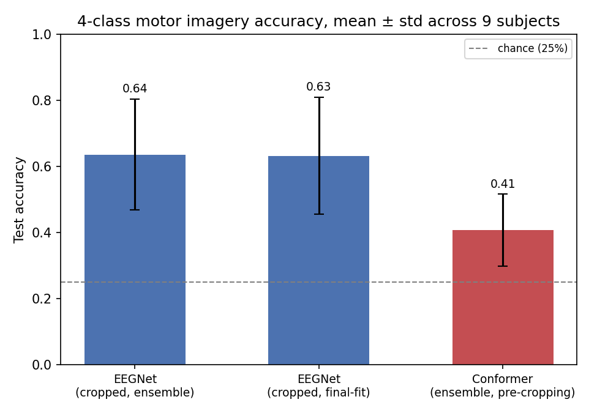

# EEG Motor Imagery Decoding with a Transformer Encoder

Within-subject 4-class motor imagery classification on BCI Competition IV Dataset 2a
[3], comparing a transformer encoder based on the EEG Conformer architecture [2]
against EEGNet [1], a standard lightweight CNN baseline for this task.

## Task

Subjects imagine a movement (left hand, right hand, feet, or tongue) without actually
moving it; the task is decoding which one from EEG alone. 9 subjects, 22 channels,
288 trials per subject split evenly across two recorded sessions (`0train`, `1test`),
recorded by the Institute for Knowledge Discovery (Laboratory of Brain-Computer
Interfaces), Graz University of Technology, for BCI Competition IV [3]. Models are
trained and evaluated per subject, using the dataset's original session split rather
than a random one, so results are directly comparable to published baselines rather
than to an arbitrary held-out slice.

## Results



| | Accuracy | Kappa |
|---|---|---|
| EEGNet, ensemble (5-fold, cropped training) | 0.636 ± 0.168 | 0.525 ± 0.222 |
| EEGNet, final-fit (100% of train session, cropped) | 0.632 ± 0.177 | 0.506 ± 0.224 |
| EEGNet, ensemble (5-fold, cropped + CSP-init) | 0.685 ± 0.115 | 0.580 ± 0.154 |
| EEGNet, final-fit (cropped + CSP-init) | 0.643 ± 0.119 | 0.524 ± 0.159 |
| Conformer, ensemble (5-fold, cropped training) | 0.459 ± 0.160 | 0.278 ± 0.213 |
| Conformer, final-fit (100% of train session, cropped) | 0.439 ± 0.139 | 0.253 ± 0.186 |

Mean ± std across the 9 subjects (sample std). Both EEGNet numbers sit in the range
reported for this exact architecture and dataset in the published literature [1]
(roughly 63-72% accuracy, κ≈0.5-0.6).

## Methodology

- **Split**: session-based (official competition split), not random — train/val
  drawn only from the training session, test session held out entirely until final
  scoring, never touched during model or hyperparameter selection.
- **Preprocessing**: 4-38 Hz bandpass, resampled to 250 Hz, per-channel z-score
  normalization fit on the training session only.
- **Validation**: single 80/20 split or stratified k-fold, selectable per run.
  Hyperparameters are selected via k-fold rather than a single split.
- **Cropped training**: trials are sliced into overlapping windows as training
  augmentation, loosely following [4]; evaluation crops test trials the same way and
  averages predictions per trial. This was the single largest lever tried, worth
  roughly 6-9 accuracy points on its own.
- **Reporting**: accuracy and Cohen's kappa, mean ± std across subjects, not a single
  headline number. For k-fold runs, three numbers are computed: the plain average of
  each fold model's own score, an ensemble score (averaging the fold models'
  predictions, not their scores — these are not the same thing and the ensemble is
  consistently the stronger of the two), and a final model retrained on the full
  training session using a step-matched epoch budget from cross-validation.
- **Reproducibility**: model initialization and data shuffling are seeded per
  subject, so repeat runs with identical config are exactly reproducible.

## Repository structure

```
data/                 raw input only (MOABB/MNE cache)
output/                checkpoints, results, figures
src/
  config.py            all hyperparameters and paths, as dataclasses
  data_loader.py        MOABB/MNE loading, session split, normalization, cropping
  models/
    eegnet.py            CNN baseline
    conformer.py          transformer encoder
  train.py              trains and checkpoints; never touches the test session
  evaluate.py            scores saved checkpoints on the test session
  sweep.py               hyperparameter search, single-split or k-fold
```

`train.py` and `evaluate.py` are deliberately separate: training only ever produces
checkpoints, scoring is a distinct step that loads them back. This means evaluation
logic can change (a new metric, a different ensembling scheme) without retraining,
and it keeps the "never touch the test set during training" guarantee mechanical
rather than a matter of remembering not to.

## Usage

Run everything from inside `src/`. Requires `pip install -r requirements.txt`; a GPU
runtime (Colab or similar) is assumed for anything beyond a quick smoke test.

Train:
```
python train.py {eegnet,conformer} [--n-folds N] [--cropped] [--csp-init]
```
`--n-folds` defaults to 1 (single 80/20 split); any value ≥2 runs stratified k-fold,
producing one checkpoint per fold plus a final model retrained on the full training
session. `--cropped` enables crop-based training/evaluation. `--csp-init` initializes
EEGNet's spatial filters from per-subject CSP components instead of random weights
(EEGNet only).
Writes `output/{model}_checkpoints.json`.

Evaluate:
```
python evaluate.py {eegnet,conformer} [{eegnet,conformer} ...]
```
Loads the checkpoint manifest written by `train.py`, scores every checkpoint on the
test session, prints per-subject and aggregate metrics, and writes
`output/{model}_results.json` and `output/summary.json`. `config.py` must match
whatever was in effect when the checkpoints were trained — nothing syncs this
automatically.

Sweep:
```
python sweep.py {eegnet,conformer} [--n-folds N]
```
Grid search over a small `lr`/`dropout` grid (edit `DEFAULT_GRIDS` in `sweep.py` to
change it), evaluated via k-fold by default. Writes `output/{model}_sweep.json`,
sorted best first. Does not modify `config.py` — applying a sweep result as the new
default is a manual edit.

## References

1. V. J. Lawhern, A. J. Solon, N. R. Waytowich, S. M. Gordon, C. P. Hung, and B. J.
   Lance, "EEGNet: A compact convolutional neural network for EEG-based
   brain-computer interfaces," *Journal of Neural Engineering*, vol. 15, no. 5,
   p. 056013, 2018.
2. Y. Song, Q. Zheng, B. Liu, and X. Gao, "EEG Conformer: Convolutional transformer
   for EEG decoding and visualization," *IEEE Transactions on Neural Systems and
   Rehabilitation Engineering*, vol. 31, pp. 710-719, 2023.
3. C. Brunner, R. Leeb, G. Müller-Putz, A. Schlögl, and G. Pfurtscheller, "BCI
   Competition 2008 - Graz data set A," 2008.
   [Dataset description](https://www.bbci.de/competition/iv/desc_2a.pdf) ·
   [competition page](https://www.bbci.de/competition/iv/).
4. R. T. Schirrmeister, J. T. Springenberg, L. D. J. Fiederer, M. Glasstetter,
   K. Eggensperger, M. Tangermann, F. Hutter, W. Burgard, and T. Ball, "Deep
   learning with convolutional neural networks for EEG decoding and
   visualization," *Human Brain Mapping*, vol. 38, no. 11, pp. 5391-5420, 2017.

## Limitations

Single dataset, within-subject only (no cross-subject generalization claim), 9
subjects.
